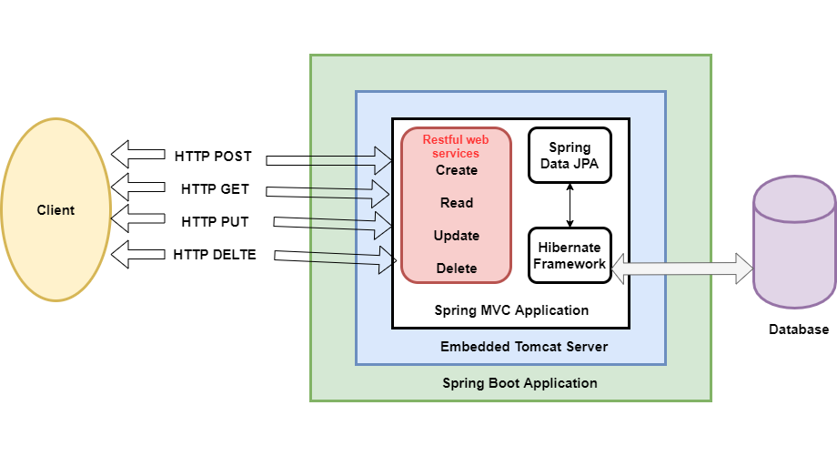

# Spring Boot CRUD Operations 

In this tutorial, you will learn how to create APIs/methods for crud operations in spring boot application which modify the data in the database using hibernate/JPA persistence APIs.

In this example, we are creating crud operations and exposing them through REST APIs so that UI clients can invoke these operations. The demo operations enable the clients to modify the product records in the database.



Create a new Spring Project using [https://start.spring.io/](https://start.spring.io/)

```
<?xml version="1.0" encoding="UTF-8"?>
<project xmlns="http://maven.apache.org/POM/4.0.0" xmlns:xsi="http://www.w3.org/2001/XMLSchema-instance"
 xsi:schemaLocation="http://maven.apache.org/POM/4.0.0 https://maven.apache.org/xsd/maven-4.0.0.xsd">
 <modelVersion>4.0.0</modelVersion>
 <parent>
     <groupId>org.springframework.boot</groupId>
     <artifactId>spring-boot-starter-parent</artifactId>
     <version>{Get the latest version!!!}</version>
     <relativePath/> <!-- lookup parent from repository -->
 </parent>
 <groupId>net.javaguides.springboot</groupId>
 <artifactId>springboot-crud-hibernate-example</artifactId>
 <version>0.0.1-SNAPSHOT</version>
 <name>{Name the app something}</name>
 <description>spring boot crud operations example with hibernate</description>

 <properties>
     <java.version>1.8</java.version>
 </properties>

 <dependencies>
    <dependency>
      <groupId>org.springframework.boot</groupId>
      <artifactId>spring-boot-starter-data-jpa</artifactId>
  </dependency>
  <dependency>
      <groupId>org.springframework.boot</groupId>
      <artifactId>spring-boot-starter-web</artifactId>
   </dependency>

  <dependency>
      <groupId>com.h2database</groupId>
      <artifactId>h2</artifactId>
      <scope>runtime</scope>
  </dependency>
  <dependency>
      <groupId>org.springframework.boot</groupId>
      <artifactId>spring-boot-starter-test</artifactId>
      <scope>test</scope>
  </dependency>
 </dependencies>

 <build>
  <plugins>
   <plugin>
    <groupId>org.springframework.boot</groupId>
    <artifactId>spring-boot-maven-plugin</artifactId>
   </plugin>
  </plugins>
 </build>
</project>
```

* spring-boot-starter-web: It is used for building a web layer, including REST APIs, applications using Spring MVC. Uses Tomcat as the default embedded container.
* spring-boot-starter-data-jpa: It includes spring data, hibernate, HikariCP, JPA API, JPA Implementation (default is hibernate), JDBC and other required libraries.
* h2: Though we can add any database easily using data source properties in the application.properties file, we are using the h2 database to reducing unnecessary complexity.

## Configure H2 Database

By default, Spring Boot configures the application to connect to an in-memory store with the username sa and an empty password. However, we can change those parameters by adding the following properties to the application.properties file:

```
spring.datasource.url=jdbc:h2:mem:testdb
spring.datasource.driverClassName=org.h2.Driver
spring.datasource.username=sa
spring.datasource.password=password
spring.jpa.database-platform=org.hibernate.dialect.H2Dialect
```

By design, the in-memory database is volatile and data will be lost when we restart the application.

## Create JPA Entity - Product.java

### ProductRepository.java

```
package <your package name>.model;

import java.math.BigDecimal;
import java.util.Date;

import javax.persistence.Column;
import javax.persistence.Entity;
import javax.persistence.GeneratedValue;
import javax.persistence.GenerationType;
import javax.persistence.Id;
import javax.persistence.Table;

import org.hibernate.annotations.CreationTimestamp;

@Entity
@Table(name = "products")
public class Product {

    @Id
    @GeneratedValue(strategy = GenerationType.AUTO)
    private long id;

    @Column(name = "name")
    private String name;

    @Column(name = "description")
    private String description;

    @Column(name = "price")
    private BigDecimal price;

    @CreationTimestamp
    private Date createdAt;

    @CreationTimestamp
    private Date updatedAt;


    public long getId() {
        return id;
    }
    public void setId(long id) {
        this.id = id;
    }
    public String getName() {
        return name;
    }
    public void setName(String name) {
        this.name = name;
    }
    public String getDescription() {
        return description;
    }
    public void setDescription(String description) {
        this.description = description;
    }
    public BigDecimal getPrice() {
        return price;
    }
    public void setPrice(BigDecimal price) {
        this.price = price;
    }
    public Date getCreatedAt() {
        return createdAt;
    }
    public void setCreatedAt(Date createdAt) {
        this.createdAt = createdAt;
    }
    public Date getUpdatedAt() {
        return updatedAt;
    }
    public void setUpdatedAt(Date updatedAt) {
        this.updatedAt = updatedAt;
    }
}
```

## Create a Spring Data Repository - ProductRepository.java

```
package <your package name>.repository;

import org.springframework.data.jpa.repository.JpaRepository;

import net.javaguides.springboot.model.Product;

public interface ProductRepository extends JpaRepository<Product, Long> {

}
```

## Service Layer

### ProductService.java

```
package <your package name>.service;

import java.util.List;

import <your package name>.model.Product;

public interface ProductService {
    Product createProduct(Product product);

    Product updateProduct(Product product);

    List < Product > getAllProduct();

    Product getProductById(long productId);

    void deleteProduct(long id);
}

```

### ProductServiceImpl.java

```
package <your package name>.service;

import java.util.List;
import java.util.Optional;

import org.springframework.beans.factory.annotation.Autowired;
import org.springframework.stereotype.Service;
import org.springframework.transaction.annotation.Transactional;

import <your package name>.exception.ResourceNotFoundException;
import <your package name>.model.Product;
import <your package name>.repository.ProductRepository;

@Service
@Transactional
public class ProductServiceImpl implements ProductService {


    @Autowired
    private ProductRepository productRepository;


    @Override
    public Product createProduct(Product product) {
        return productRepository.save(product);
    }

    @Override
    public Product updateProduct(Product product) {
        Optional < Product > productDb = this.productRepository.findById(product.getId());

        if (productDb.isPresent()) {
            Product productUpdate = productDb.get();
            productUpdate.setId(product.getId());
            productUpdate.setName(product.getName());
            productUpdate.setDescription(product.getDescription());
            productRepository.save(productUpdate);
            return productUpdate;
        } else {
            throw new ResourceNotFoundException("Record not found with id : " + product.getId());
        }
    }

    @Override
    public List < Product > getAllProduct() {
        return this.productRepository.findAll();
    }

    @Override
    public Product getProductById(long productId) {

        Optional < Product > productDb = this.productRepository.findById(productId);

        if (productDb.isPresent()) {
            return productDb.get();
        } else {
            throw new ResourceNotFoundException("Record not found with id : " + productId);
        }
    }

    @Override
    public void deleteProduct(long productId) {
        Optional < Product > productDb = this.productRepository.findById(productId);

        if (productDb.isPresent()) {
            this.productRepository.delete(productDb.get());
        } else {
            throw new ResourceNotFoundException("Record not found with id : " + productId);
        }

    }
}
```

## Spring REST Controller 
Finally, expose all operations through MVC URLs or REST endpoints. Clients will connect with these endpoints to create/get/update/delete product records.

Notice the usage of annotations @RestController, @RequestMapping, @GetMapping, @PostMapping, and @DeleteMapping to map various URIs to controller methods.

### ProductController

```
package <your package name>.controller;

import java.util.List;

import org.springframework.beans.factory.annotation.Autowired;
import org.springframework.http.HttpStatus;
import org.springframework.http.ResponseEntity;
import org.springframework.web.bind.annotation.DeleteMapping;
import org.springframework.web.bind.annotation.GetMapping;
import org.springframework.web.bind.annotation.PathVariable;
import org.springframework.web.bind.annotation.PostMapping;
import org.springframework.web.bind.annotation.PutMapping;
import org.springframework.web.bind.annotation.RequestBody;
import org.springframework.web.bind.annotation.RestController;

import <your package name>.model.Product;
import <your package name>.service.ProductService;

@RestController
public class ProductController {

    @Autowired
    private ProductService productService;

    @GetMapping("/products")
    public ResponseEntity < List < Product >> getAllProduct() {
        return ResponseEntity.ok().body(productService.getAllProduct());
    }

    @GetMapping("/products/{id}")
    public ResponseEntity < Product > getProductById(@PathVariable long id) {
        return ResponseEntity.ok().body(productService.getProductById(id));
    }

    @PostMapping("/products")
    public ResponseEntity < Product > createProduct(@RequestBody Product product) {
        return ResponseEntity.ok().body(this.productService.createProduct(product));
    }

    @PutMapping("/products/{id}")
    public ResponseEntity < Product > updateProduct(@PathVariable long id, @RequestBody Product product) {
        product.setId(id);
        return ResponseEntity.ok().body(this.productService.updateProduct(product));
    }

    @DeleteMapping("/products/{id}")
    public HttpStatus deleteProduct(@PathVariable long id) {
        this.productService.deleteProduct(id);
        return HttpStatus.OK;
    }
}
```

### ResourceNotFoundException.java

```
package <your package name>.controller;

import org.springframework.web.bind.annotation.ResponseStatus;

@ResponseStatus
public class ResourceNotFoundException extends RuntimeException {

    private static final long serialVersionUID = 1 L;

    public ResourceNotFoundException(String message) {
        super(message);
    }

    public ResourceNotFoundException(String message, Throwable throwable) {
        super(message, throwable);
    }
}
```


